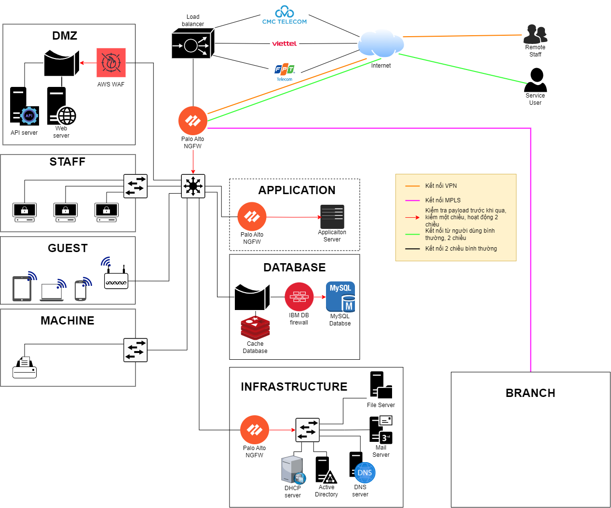

# ĐÁNH GIÁ AN TOÀN THÔNG TIN

Ví dụ đề tài:

Hiện tại doanh nghiệp có khoảng 100 người dùng. Thông tin chi tiết các dịch vụ chạy trong hệ thống xem hình bên dưới. Những thông tin chi tiết về hệ thống:

- Quản trị theo mô hình Domain
- Router Cisco tích hợp firewall
- Thiết bị cân bằng tải kết nối internet
- Không có phần mềm antivirus, firewall chuyên dụng cũng như các chính sách bảo mật khác.
- Chưa có chính sách vận hành hệ thống
- Chưa có chính sách về vấn đề an toàn thông tin trong hệ thống
- Chưa có chính sách sao lưu và phục hồi dữ liệu
- Tất cả các máy chủ đặt tại Data Center

## Phân tích điểm yếu mô hình hiện tại

Một số điểm yếu của mô hình hiện tại có thể kể đến như:

- Không có tường lửa chuyên dụng thì sẽ không có khả năng phát hiện ngăn chặn các cuộc tấn công tinh vi.
- Không có phần mềm anti-virus dẫn đến doanh nghiệp có thể bị nhiễm mã độc chẳn hạn Randsomware.
- Không có chính sách vận hành hệ thống (ví dụ như không sử dụng các giao thức mã hóa, không phân quyền để truy cập tài nguyên) dẫn đến bất cứ ai trong doanh nghiệp cũng có thể truy cập (số) đến các tài nguyên nhạy cảm hay thực hiện nghe lén để thu thập thông tin.
- Chưa có chính sách hay quy định về vấn đề an toàn thông tin trong hệ thống sẽ không quản lý được hành vi vô tình/cố ý của các nhân viên/khách trong mạng truy cập và phân phát dữ liệu nhạy cảm (tiếp cận số), tiếp cận các tài nguyên (tiếp cận vật lý) hay cài đặt các dữ liệu độc hại (cắm USB có mã độ, cài đặt tệp .DOC có chứa revershell vào máy, tệp độc hại từ Email hay từ kênh chat trên mạng xã hội như Facebook, ...).
- Tất cả máy chủ đặt tại Data Center và không có chính sách sao lưu và phục hồi dữ liệu thì nếu có thiên tai hoặc xảy ra hỏa hoạn hay bạo động tại nơi đặt datacenter có thể mất tất cả dữ liệu.

## Đánh giá an toàn

...

## Thiết kế an toàn

## Vai trò của mỗi công nghệ

ACL:

- Kiểm soát truy cập khu vực Head Office vào khu vực Infrastructure.

Palo Alto NGFW (Next-Generation Firewall):

- Kiểm soát, hạn chế nhân viên các thao tác trên Internet.
- Kiểm hoát các hành vi của staff vào các hệ thống phục vụ vận hành doanh nghiệp.

AWS Web-App Firewall:

- Kiểm tra, normalize các API request hay Web request từ nguời dùng cuối/khách hàng.

IBM DB Firewall:

- Kiểm tra, normalize các Query đến cơ sở dữ liệu.

Endpoint Security:

- ...

SIEM/SOAR:

- ...
